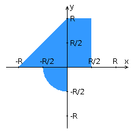

# web-sem3-lab4-frontend

Фронт 4 лабы

Внимание! У разных вариантов разный текст задания!

Переписать приложение из предыдущей лабораторной работы с использованием следующих технологий:

- Уровень back-end должен быть основан на Java EE (необходимо использовать EJB).
- Уровень front-end должен быть построен на React + Redux (необходимо использовать ES6 и JSX) с использованием набора компонентов PrimeReact
- Взаимодействие между уровнями back-end и front-end должно быть организовано посредством REST API.

Приложение по-прежнему должно включать в себя 2 страницы - стартовую и основную страницу приложения. Обе страницы приложения должны быть адаптированы для отображения в 3 режимах:

+- "Десктопный" - для устройств, ширина экрана которых равна или превышает 1193 пикселей.
+- "Планшетный" - для устройств, ширина экрана которых равна или превышает 829, но меньше 1193 пикселей.
+- "Мобильный"- для устройств, ширина экрана которых меньше 829 пикселей.

Стартовая страница должна содержать следующие элементы:

+"Шапку", содержащую ФИО студента, номер группы и номер варианта.
- Форму для ввода логина и пароля. Информация о зарегистрированных в системе пользователях должна храниться в отдельной таблице БД (пароль должен храниться в виде хэш-суммы). Доступ неавторизованных пользователей к основной странице приложения должен быть запрещён.

Основная страница приложения должна содержать следующие элементы:

- Набор полей ввода для задания координат точки и радиуса области в соответствии с вариантом задания: Dropdown {'-2','-1.5','-1','-0.5','0','0.5','1','1.5','2'} для координаты по оси X, Slider (-3 ... 5) для координаты по оси Y, и Dropdown {'-2','-1.5','-1','-0.5','0','0.5','1','1.5','2'} для задания радиуса области. Если поле ввода допускает ввод заведомо некорректных данных (таких, например, как буквы в координатах точки или отрицательный радиус), то приложение должно осуществлять их валидацию.
- Динамически обновляемую картинку, изображающую область на координатной плоскости в соответствии с номером варианта и точки, координаты которых были заданы пользователем. Клик по картинке должен инициировать сценарий, осуществляющий определение координат новой точки и отправку их на сервер для проверки её попадания в область. Цвет точек должен зависить от факта попадания / непопадания в область. Смена радиуса также должна инициировать перерисовку картинки.
- Таблицу со списком результатов предыдущих проверок.
- Ссылку, по которой аутентифицированный пользователь может закрыть свою сессию и вернуться на стартовую страницу приложения.

Дополнительные требования к приложению:

- Все результаты проверки должны сохраняться в базе данных под управлением СУБД PostgreSQL.
- Для доступа к БД необходимо использовать JPA.

### Вопросы к защите лабораторной работы:

- Платформа Java EE. Спецификации и их реализации.
- Принципы IoC, CDI и Location Transpanency. Компоненты и контейнеры.
- Управление жизненным циклом компонентов. Дескрипторы развёртывания.
- Java EE API. Виды компонентов. Профили платформы Java EE.
- Компоненты EJB. Stateless & Stateful Session Beans. EJB Lite и EJB Full.
- Работа с электронной почтой в Java EE. JavaMail API.
- JMS. Реализация очередей сообщений. Способы доставки сообщений до клиента. Message-Driven Beans.
- Понятие транзакции. Управление транзакциями в Java EE. JTA.
- Веб-сервисы. Технологии JAX-RS и JAX-WS.
- Платформа Spring. Сходства и отличия с Java EE.
- Модули Spring. Архитектура Spring Runtime. Spring Security и Spring Data.
- Реализация IoC и CDI в Spring. Сходства и отличия с Java EE.
- Реализация REST API в Java EE и Spring.
- React JS. Архитектура и основные принципы разработки приложений.
- Компоненты React. State & props. "Умные" и "глупые" компоненты.
- Разметка страниц в React-приложениях. JSX.
- Навигация в React-приложениях. ReactRouter.
- Управление состоянием интерфейса. Redux.
- Angular: архитектура и основные принципы разработки приложений.
- Angular: модули, компоненты, сервисы и DI.
- Angular: шаблоны страниц, жизненный цикл компонентов, подключение CSS.
- Angular: клиент-серверное взаимодействие, создание, отправка и валидация данных форм.

